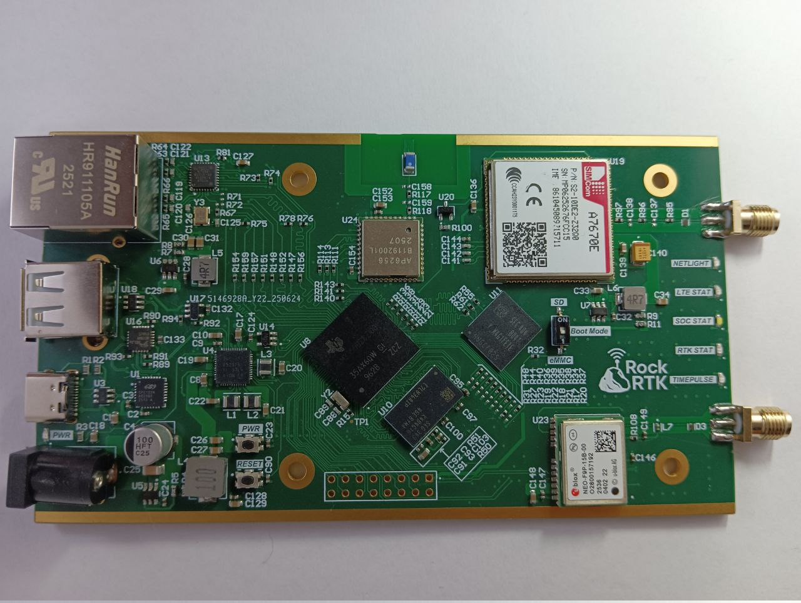
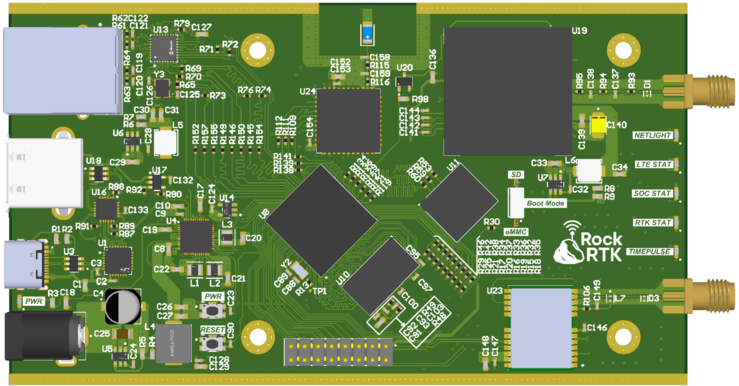
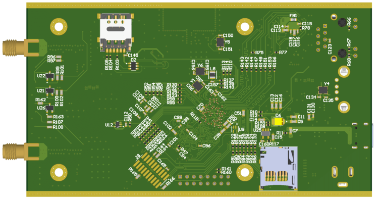
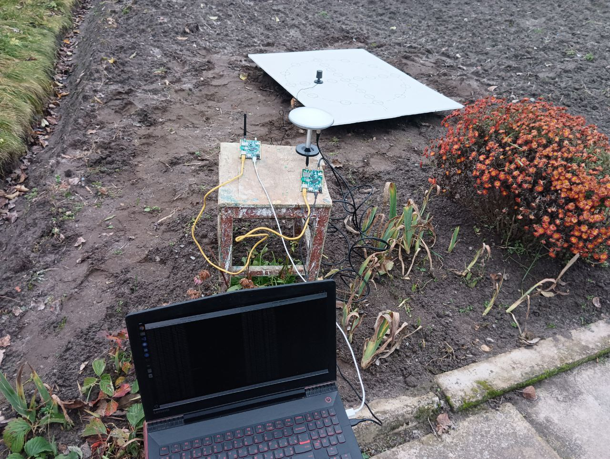

# RockRTK

A custom hardware platform based on **Texas Instruments AM3358** for **RTK (Real-Time Kinematic)** applications, providing high-precision positioning with integrated communication interfaces.



## Repository Structure

```
rockrtk/
├── hardware/   # Altium Designer project (schematics, PCB layout)
└── buildroot/  # Buildroot external tree (firmware, kernel, bootloader)
```

## Hardware

[hardware/](hardware/) contains the full Altium Designer project:

- **Processor**: TI AM3358 ARM Cortex-A8
- **GNSS**: u-blox NEO-F9P (multi-band RTK)
- **LTE**: SIMCom A7670E
- **Wi-Fi / Bluetooth**: AP6256 (SDIO)
- **Storage**: eMMC + microSD
- **Networking**: Ethernet

| | |
|:---:|:---:|
|  |  |
| Top | Bottom |



See [hardware/README.md](hardware/README.md) for schematic PDF.

## Software

[buildroot/](buildroot/) is a Buildroot external tree. Clone this repository one level below Buildroot and run:

```bash
make BR2_EXTERNAL=../rockrtk/buildroot rockrtk_defconfig
```

## License

- `hardware/`, `buildroot/` — [MIT](LICENSE)
- `buildroot/board/rockrtk/patches/linux/` — GPL-2.0 (derivative works of Linux kernel)
